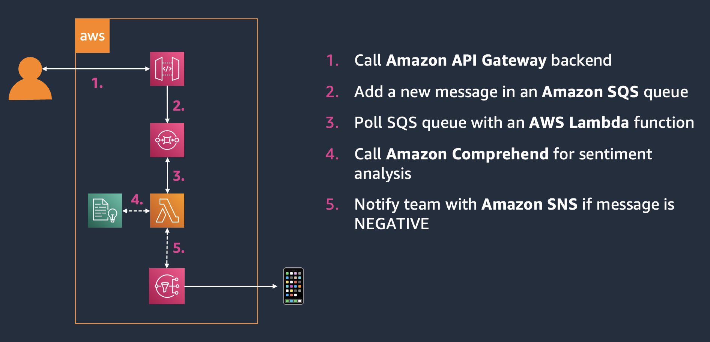
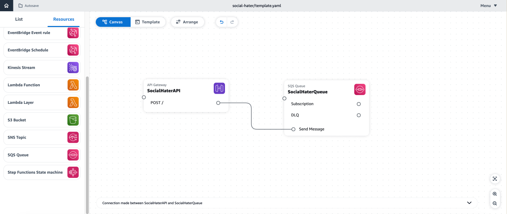
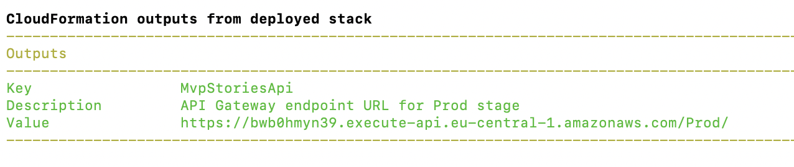

# Social Control Demo

## Prerequisites

In order to proceed with the demo, you should have the following:
- [AWS CLI](https://docs.aws.amazon.com/cli/latest/userguide/getting-started-install.html) installed
- [AWS SAM](https://docs.aws.amazon.com/serverless-application-model/latest/developerguide/install-sam-cli.html) installed
- [Configure your AWS credentials](https://docs.aws.amazon.com/cli/latest/userguide/cli-chap-configure.html)

## What we are building

This repository contains a demo using AWS Application Composer and serverless technologies. We will be building an API allowing you to post messages and get notified whenever a message is identified as negative.

Our api should accept the following call:

>  **URL** : `YOUR_API_ENDPOINT`
>
> **PATH**: `/`
>
>  **Method** : `POST`
>
>  **Auth** : `NONE`
>
>  **Headers**: `Content-Type: application/json`
>
>  **Body** :
>
>  ```json
>    {
>      "content": "I am not happy at all with your service.",
>      "sender": "Angry Customer",
>      "id": "as123kjsad21d032d3921031"
>    }
>  ```

## Architecture



## Reproduction steps

### Define our infrastructure with AWS Application Composer

In this demo we will start building an API. In order to do so, we will be leveraging [AWS Application Composer](https://aws.amazon.com/application-composer/).

1. Create a directory in which you wish to create your project on your local computer
2. Head to the [Application Composer console](https://console.aws.amazon.com/composer/home)
3. Click on **create project**
4. Click on **Menu** and **Activate local sync**
5. Select the local directory you have created in point 1
6. Drag and drop an API Gateway resource into the canvas
7. Click on the resource, then details and call it **SocialControlApi**
8.  Change the method from GET to POST
9.  Click save 
    
10. Drag and drop an SQS Queue resource in the canvas
11. Change the logical ID to **SocialControlQueue**
12. Click save
13. Link **SocialControlQueuer** with **SocialControlQueue**

14. Drag and drop a Lambda resource into the canvas
15. Change the logical ID to **SocialControlHandler**
16. Click save
17. Link Subscription of the **SocialControlQueue** with **SocialControlHandler**
  [plot](./images/infra/3.png)
18. Click on the **SocialControlHandler** resource details and scroll down to **Permissions**
19. Paste the following code
  ```yaml
  - Statement:
      - Effect: Deny
        Action:
          - sns:Publish
        Resource: arn:aws:sns:*:*:*
      - Effect: Allow
        Action:
          - sns:Publish
        Resource: '*'
  - Statement:
      - Effect: Allow
        Action:
          - comprehend:DetectSentiment
        Resource: '*'
  ```


  > These policies will:
  >  1. Allow the lambda function to send SMS through the Amazon SNS service (but not to acces any topic)
  >  2. Allow the lambda to perform the DetectSentiment command on Amazon Comprehend
20.  Click save
    


### Define lambda execution logic

Now we want to code the execution logic of our lambda functions in our local computer.

1. Head to the directory you connected with Application Composer.
2. Open your `template.yaml` file. This file contains all your SAM configuration and will be used to deploy resources on AWS.
3. Head to the end of the `template.yml` document and paste the following code:
    ```yaml
    Outputs:
      MvpStoriesApi:
        Description: "API Gateway endpoint URL for Prod stage"
        Value: !Sub "https://${SocialControlApi}.execute-api.${AWS::Region}.amazonaws.com/Prod/"
    ```
    This change will make sure that everytime you deploy your application with SAM, the API Gateway endpoint will be displayed.
4. Ιn the `src/Function` directory, change the extension of the the `index.js` file to `index.mjs`
5. Let's head to the `src/Function/index.mjs` file and paste the following code:
    ```js
    import { SNSClient, PublishCommand } from "@aws-sdk/client-sns"
    import { ComprehendClient, DetectSentimentCommand } from "@aws-sdk/client-comprehend"

    export const handler = async (event) => {
      await Promise.all(event.Records.map(record => {
        const message = JSON.parse(record.body).data
        return handleMessage(message)
      }))
    }

    const handleMessage = async (message) => {
      const comprehendInput = { Text: message.content, LanguageCode: "en" }
      const comprehendClient = new ComprehendClient()
      const comprehendCommand = new DetectSentimentCommand(comprehendInput)
      const comprehendResponse = await comprehendClient.send(comprehendCommand)
      
      console.log(`Sentiment is ${comprehendResponse.Sentiment}`)
      if (comprehendResponse.Sentiment === "NEGATIVE") {
        const snsInput = { Message: `ALERT: Angry customer message received from ${message.sender} (ID: ${message.id})`, PhoneNumber: "YOUR_PHONE_NUMBER" }
        const snsClient = new SNSClient()
        const snsCommand = new PublishCommand(snsInput)
        await snsClient.send(snsCommand)
        console.log("SMS Sent")
      }
    }
    ```
    This code extracts the message from SQS. It then makes a call to Amazon Comprehend to assess if the message is negative. If it is negative it sends a message to the phone number hard coded in this code snippet.
    > NOTE: For testing purposes, you need to add your phone number to the SNS service before being able to send SMS messages to your phone number.

  ### Deploying our API

  Now that we have all the configuration of our application ready, let's deploy it.

  1. At the root of your project run `sam build` this will build your deployment files into a directory called `.aws-sam`
  2. Run `sam deploy --guided`
   This command will ask for some information regarding your deployment, you can fill the values in as follows:
   
  3. At the end of your deployment results, you should be able to find the outputs that should look like this:
  
  4. Copy the API endpoint and test your api with the following command
  ```sh
    curl --location 'API_ENDPOINT' \
    --header 'Content-Type: application/json' \
    --data '{
        "content": "Not happy at all with the service",
        "sender": "Angry sender",
        "id": "Angry ID"
    }'
  ```
  5. Copy the API endpoint and test your api with the following command
  ```sh
    curl --location 'API_ENDPOINT' \
    --header 'Content-Type: application/json' \
    --data '{
        "content": "Very happy with the service",
        "sender": "Happy sender",
        "id": "Happy ID"
    }'
  ```

## Conclusion

In this demo, we have built a basic API that covers our requirements. This is kept very basic for the sake of this demo. Many improvements can be added to this example such as:
- Implementing API keys for API Gateway
- Storing the messages in a DynamoDB table for long term persistance
- ...